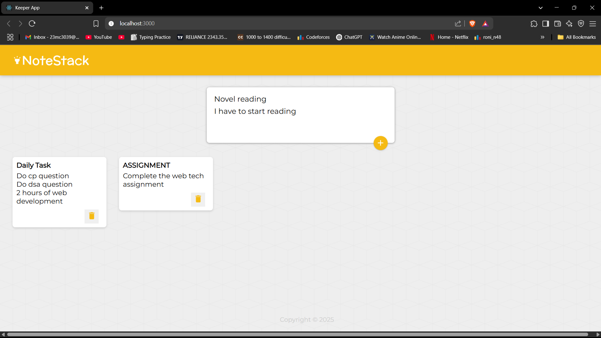

# 📝 React Note-Taking App

A simple and lightweight note-taking web application built using **React.js**. This app allows users to create, view, and delete notes — all in a clean and intuitive UI. Currently, the data is stored only in the browser (no backend).

---

## 🚀 Features

- 🧠 Create and save notes instantly
- 🗑️ Delete notes with a single click
- 🌙 Light and simple interface
- ⚛️ Built entirely with ReactJS

---

## 🖼️ Preview

 <!-- Optional: Include a screenshot of your app -->

---

## 🛠️ Tech Stack

- React.js
- HTML5 & CSS3
- JavaScript (ES6+)

---

